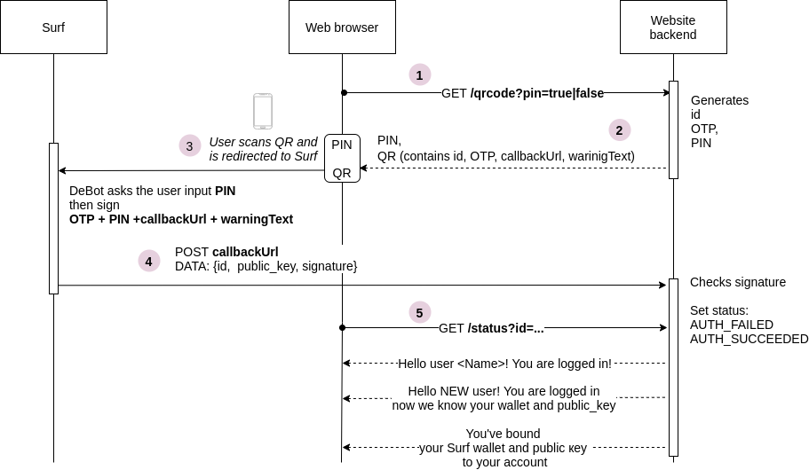

# Surf Auth DeBot

This DeBot can be used in "Sign Up" / "Sign In" flows as well as in the case when an already registered user wants to link his Surf account.

## Workflow

 - Web server generates one time password (OTP) and some PIN (optionally), which user should sign in Surf

 - User signs this OTP + PIN, and returns his signature and public key to the server

 -  If the signature is correct, the server knows that this user is the real owner of this public key.



## Prerequisites

    npm, node.js ver>=14, tondev

## The quickest start (if you want to use DeBot  already deployed in net.ton.dev)

1. Run local webserver
```
$ cd example-webserver-nodejs/
$ npm i
$ npm start
```

2.  Open http://localhost:8080/surfauth.html?pin=true in a browser 

3. Click on the link shown to open Surf on your local computer. **Do not scan** the QR code with your mobile phone, because the test web server is running on your local computer!

## If you want to deploy DeBot by yourself

1. Deploy DeBot
```
$ ./compile_and_deploy.sh 
```
Remember debot_adress

2. Run local webserver
```
$ cd example-webserver-nodejs/
$ npm i
$ node src/main <debot_address>
```

3.  Open http://localhost:8080/surfauth.html?pin=true in a browser 
